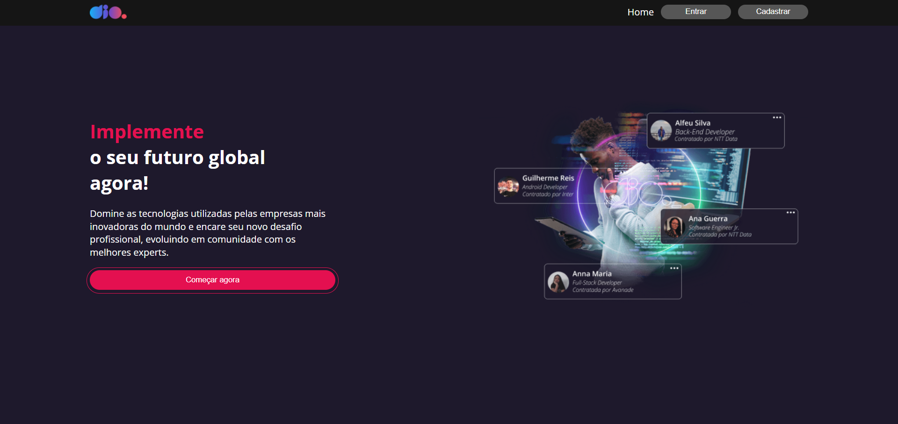

<p align="center">
  <a href="#project">Project</a>&nbsp;&nbsp;&nbsp;|&nbsp;&nbsp;&nbsp;
  <a href="#-technologies">Technologies</a>&nbsp;&nbsp;&nbsp;|&nbsp;&nbsp;&nbsp;
  <a href="#-Getting started">Getting started</a>&nbsp;&nbsp;&nbsp;|&nbsp;&nbsp;&nbsp;
  <a href="#-layout">Layout</a>&nbsp;&nbsp;&nbsp;|&nbsp;&nbsp;&nbsp;
</p>

<br>

---
<h1 align="center">
    
</h1>

---
## 💻 Project

Desafio para a Formação React Developer da dio.me:
Objetivo: Desenvolver a tela de cadastro com os ensinamentos das aulas onde desenvolvi as paginas Home, Login e Feed.
Aprendi a usar o react-hook-form para lidar com formulários

## 🧪 Technologies

This project was developed using the following technologies:
 
- [ReactJS](https://react.dev/)
- [react-hook-form](https://react-hook-form.com/)
- [styled-components](https://styled-components.com/)
- [json-server](https://github.com/typicode/json-server)
- [react-router-dom](https://www.npmjs.com/package/react-router-dom)
- [react-icons](https://react-icons.github.io/react-icons/)
- [axios](https://axios-http.com/)
- [yup](https://www.npmjs.com/package/yup)

## 🚀 Getting started

Clone the project and access the folder.

```bash
$ git clone https://github.com/MaykonRaphael/dio-clone.git
$ cd dio-clone
```

Instal all dependencies
```bash
$ npm i
```

Start the project
```bash
$ npm run start
```

## 🔖 Layout

You can view the project layout through the links below:

- [Layout](https://www.figma.com/file/Stq6FpVPmSzi0lakCPnazr/DIO-Clone?type=design&node-id=0-1&t=U7w12MHDWfPsMH7m-0)

Remembering that you need to have a [Figma](http://figma.com/) account to access it.